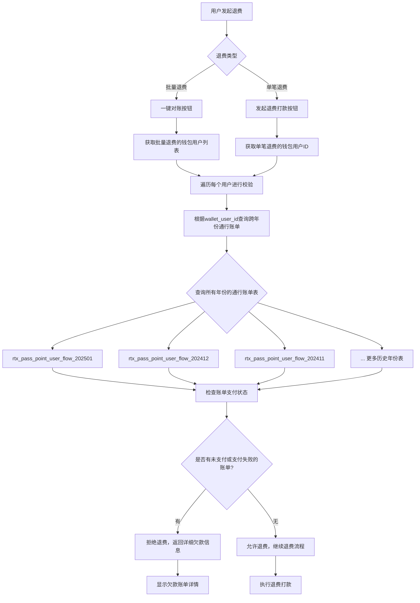

# 新发行退费打款校验功能 - 数据库表分析及测试数据准备指南

## 1. 涉及的核心数据库表

### 1.1 退费相关表（fenmi_etc 数据库）

#### 🔸 etc_refund_record（退费记录表）
**作用**：存储所有退费申请记录
```sql
-- 关键字段
wallet_user_id BIGINT(20)     -- 钱包用户ID（关联键）
wallet_id_card VARCHAR(30)    -- 钱包用户身份证
refund_amount DECIMAL(11,2)   -- 退费金额
refund_status INT(2)          -- 退费状态
org_trx_no VARCHAR(40)        -- 原交易流水号
refund_trx_no VARCHAR(50)     -- 退费交易流水号
```

#### 🔸 etc_deduct_refund（扣费退费表）
**作用**：ETC扣费相关的退费记录

#### 🔸 etc_deduct_refund_pay_record（退费打款记录表）
**作用**：退费打款的具体记录

### 1.2 钱包用户相关表（fenmi_wallet 数据库）

#### 🔸 acc_wallet_account_info（钱包账户信息表）
**作用**：钱包用户基本信息
```sql
-- 关键字段
id BIGINT(20)                 -- 钱包用户ID
account_id_code VARCHAR(35)   -- 身份证号码
account_name VARCHAR(30)      -- 用户姓名
account_phone_number CHAR(11) -- 手机号
account_status INT(1)         -- 账户状态
account_balance DECIMAL(11,2) -- 账户余额
```

### 1.3 通行账单相关表（rtx 数据库）

#### 🔸 rtx_etc_service_deduct_record（ETC服务扣费记录表）
**作用**：ETC通行扣费的详细记录
```sql
-- 关键字段
etc_card_user_id BIGINT(32)   -- ETC卡用户ID（关联钱包用户）
id_code VARCHAR(50)           -- 身份证号码
status INT(11)                -- 支付状态（关键！）
  -- 0: 待支付/未支付
  -- 1: 支付成功
  -- 2: 支付失败
fee VARCHAR(10)               -- 通行费用
total_fee VARCHAR(10)         -- 总费用
deduc_time DATETIME           -- 扣费时间
pay_time DATETIME             -- 支付时间
pay_success_time DATETIME     -- 支付成功时间
refund_status INT(11)         -- 退费状态
```

#### 🔸 rtx_pass_point_user_flow_YYYYMM（按年月分表的通行积分流水）
**作用**：用户通行的详细流水记录（按年月分表）
```sql
-- 关键字段
etc_card_user_id BIGINT(20)   -- ETC卡用户ID
id_code VARCHAR(32)           -- 身份证号码
fee DECIMAL(11,2)             -- 费用
flow_type INT(1)              -- 流水类型
-- 表名格式：rtx_pass_point_user_flow_202501, rtx_pass_point_user_flow_202412, etc.
```

#### 🔸 rtx_etc_deduc_bill（ETC扣费账单汇总表）
**作用**：按日期汇总的扣费账单
```sql
-- 关键字段
bill_date VARCHAR(12)         -- 账单日期
pay_status INT(1)             -- 支付状态
refund_status INT(1)          -- 退费状态
bill_amt DECIMAL(13,2)        -- 账单金额
refund_amt DECIMAL(10,2)      -- 退费金额
```

### 1.4 按年份分表的通行账单表

根据数据库分析，通行账单按年月分表存储：
- **rtx_pass_point_user_flow_202501**（2025年1月）
- **rtx_pass_point_user_flow_202412**（2024年12月）
- **rtx_pass_point_user_flow_202411**（2024年11月）
- **...**
- **rtx_pass_point_user_flow_202306**（2023年6月）

## 2. 业务流程分析

### 2.1 退费校验业务流程



### 2.2 数据关联关系

```
钱包用户 (fenmi_wallet.acc_wallet_account_info)
    ↓ (通过 id 关联)
退费记录 (fenmi_etc.etc_refund_record.wallet_user_id)
    ↓ (通过 wallet_user_id 关联)
通行账单 (rtx.rtx_pass_point_user_flow_YYYYMM.etc_card_user_id)
```

## 3. 测试数据准备指南

### 3.1 准备测试用户数据

#### 步骤1：创建钱包用户
```sql
-- 在 fenmi_wallet.acc_wallet_account_info 表中插入测试用户
INSERT INTO fenmi_wallet.acc_wallet_account_info (
    id, create_time, update_time, account_status, account_balance,
    account_name, account_id_code, account_type_name, account_phone_number,
    app_code, account_type_id, account_category
) VALUES 
-- 测试用户1：无欠款用户
(10001, NOW(), NOW(), 1, 1000.00, '张三', '110101199001011234', '个人账户', '13800138001', 'ETC', 1, 1),
-- 测试用户2：有历史年份欠款用户
(10002, NOW(), NOW(), 1, 500.00, '李四', '110101199002022345', '个人账户', '13800138002', 'ETC', 1, 1),
-- 测试用户3：有当前年份欠款用户
(10003, NOW(), NOW(), 1, 200.00, '王五', '110101199003033456', '个人账户', '13800138003', 'ETC', 1, 1),
-- 测试用户4：多年份都有欠款用户
(10004, NOW(), NOW(), 1, 800.00, '赵六', '110101199004044567', '个人账户', '13800138004', 'ETC', 1, 1);
```

### 3.2 准备通行账单测试数据

#### 步骤2：为测试用户创建不同状态的通行账单

```sql
-- 为用户10001创建已支付的通行账单（无欠款）
INSERT INTO rtx.rtx_pass_point_user_flow_202501 (
    etc_card_user_id, id_code, name, car_num, flow_type,
    operate_point, actual_point, fee, direction, create_time
) VALUES 
(10001, '110101199001011234', '张三', '京A12345', 1, 100, 100, 10.00, 1, NOW()),
(10001, '110101199001011234', '张三', '京A12345', 1, 150, 150, 15.00, 1, NOW());

-- 在 rtx_etc_service_deduct_record 中创建已支付记录
INSERT INTO rtx.rtx_etc_service_deduct_record (
    etc_card_user_id, id_code, fee, total_fee, status, 
    deduc_time, pay_time, pay_success_time, create_time
) VALUES 
(10001, '110101199001011234', '10.00', '10.00', 1, NOW(), NOW(), NOW(), NOW()),
(10001, '110101199001011234', '15.00', '15.00', 1, NOW(), NOW(), NOW(), NOW());

-- 为用户10002创建历史年份的未支付账单
INSERT INTO rtx.rtx_pass_point_user_flow_202412 (
    etc_card_user_id, id_code, name, car_num, flow_type,
    operate_point, actual_point, fee, direction, create_time
) VALUES 
(10002, '110101199002022345', '李四', '京B23456', 1, 200, 200, 20.00, 1, '2024-12-15 10:00:00');

INSERT INTO rtx.rtx_etc_service_deduct_record (
    etc_card_user_id, id_code, fee, total_fee, status, 
    deduc_time, create_time
) VALUES 
(10002, '110101199002022345', '20.00', '20.00', 0, '2024-12-15 10:00:00', '2024-12-15 10:00:00');

-- 为用户10003创建当前年份的支付失败账单
INSERT INTO rtx.rtx_pass_point_user_flow_202501 (
    etc_card_user_id, id_code, name, car_num, flow_type,
    operate_point, actual_point, fee, direction, create_time
) VALUES 
(10003, '110101199003033456', '王五', '京C34567', 1, 300, 300, 30.00, 1, NOW());

INSERT INTO rtx.rtx_etc_service_deduct_record (
    etc_card_user_id, id_code, fee, total_fee, status, 
    deduc_time, pay_time, create_time
) VALUES 
(10003, '110101199003033456', '30.00', '30.00', 2, NOW(), NOW(), NOW());

-- 为用户10004创建多年份的欠款账单
-- 2024年未支付
INSERT INTO rtx.rtx_pass_point_user_flow_202412 (
    etc_card_user_id, id_code, name, car_num, flow_type,
    operate_point, actual_point, fee, direction, create_time
) VALUES 
(10004, '110101199004044567', '赵六', '京D45678', 1, 400, 400, 40.00, 1, '2024-12-20 15:00:00');

INSERT INTO rtx.rtx_etc_service_deduct_record (
    etc_card_user_id, id_code, fee, total_fee, status, 
    deduc_time, create_time
) VALUES 
(10004, '110101199004044567', '40.00', '40.00', 0, '2024-12-20 15:00:00', '2024-12-20 15:00:00');

-- 2025年支付失败
INSERT INTO rtx.rtx_pass_point_user_flow_202501 (
    etc_card_user_id, id_code, name, car_num, flow_type,
    operate_point, actual_point, fee, direction, create_time
) VALUES 
(10004, '110101199004044567', '赵六', '京D45678', 1, 500, 500, 50.00, 1, NOW());

INSERT INTO rtx.rtx_etc_service_deduct_record (
    etc_card_user_id, id_code, fee, total_fee, status, 
    deduc_time, pay_time, create_time
) VALUES 
(10004, '110101199004044567', '50.00', '50.00', 2, NOW(), NOW(), NOW());
```

### 3.3 准备退费测试数据

#### 步骤3：创建退费申请记录

```sql
-- 为测试用户创建退费申请
INSERT INTO fenmi_etc.etc_refund_record (
    org_trx_no, org_biz_type, refund_amount, refund_trx_no,
    wallet_id_card, wallet_user_id, merchant_no, refund_status,
    refund_way, refund_reason, create_time, update_time
) VALUES 
-- 用户10001的退费申请（应该成功）
('TRX001', 1, 100.00, 'REFUND001', '110101199001011234', 10001, 'MCH001', 0, 1, '正常退费', NOW(), NOW()),
-- 用户10002的退费申请（应该被拒绝）
('TRX002', 1, 200.00, 'REFUND002', '110101199002022345', 10002, 'MCH001', 0, 1, '正常退费', NOW(), NOW()),
-- 用户10003的退费申请（应该被拒绝）
('TRX003', 1, 150.00, 'REFUND003', '110101199003033456', 10003, 'MCH001', 0, 1, '正常退费', NOW(), NOW()),
-- 用户10004的退费申请（应该被拒绝）
('TRX004', 1, 300.00, 'REFUND004', '110101199004044567', 10004, 'MCH001', 0, 1, '正常退费', NOW(), NOW());
```

## 4. 测试执行指南

### 4.1 数据验证查询

#### 查询用户的通行账单支付状态
```sql
-- 查询用户在所有年份的通行账单支付状态
SELECT 
    etc_card_user_id,
    id_code,
    COUNT(*) as total_bills,
    SUM(CASE WHEN status = 0 THEN 1 ELSE 0 END) as unpaid_count,
    SUM(CASE WHEN status = 2 THEN 1 ELSE 0 END) as failed_count,
    SUM(CASE WHEN status = 1 THEN 1 ELSE 0 END) as paid_count,
    SUM(CASE WHEN status IN (0,2) THEN CAST(fee AS DECIMAL(10,2)) ELSE 0 END) as debt_amount
FROM rtx.rtx_etc_service_deduct_record 
WHERE etc_card_user_id IN (10001, 10002, 10003, 10004)
GROUP BY etc_card_user_id, id_code;
```

#### 查询跨年份的欠款账单
```sql
-- 动态查询所有年份的欠款账单（需要在应用代码中实现）
-- 示例：查询2024年12月的欠款
SELECT * FROM rtx.rtx_pass_point_user_flow_202412 
WHERE etc_card_user_id = 10002;

-- 示例：查询2025年1月的欠款
SELECT * FROM rtx.rtx_pass_point_user_flow_202501 
WHERE etc_card_user_id IN (10003, 10004);
```

### 4.2 测试场景执行

#### 场景1：无欠款用户退费测试
- **用户**：10001（张三）
- **预期结果**：退费校验通过，允许退费
- **验证SQL**：
```sql
SELECT * FROM rtx.rtx_etc_service_deduct_record 
WHERE etc_card_user_id = 10001 AND status IN (0, 2);
-- 应该返回0条记录
```

#### 场景2：历史年份欠款用户退费测试
- **用户**：10002（李四）
- **预期结果**：退费校验失败，拒绝退费
- **验证SQL**：
```sql
SELECT * FROM rtx.rtx_etc_service_deduct_record 
WHERE etc_card_user_id = 10002 AND status = 0;
-- 应该返回2024年的未支付记录
```

#### 场景3：当前年份欠款用户退费测试
- **用户**：10003（王五）
- **预期结果**：退费校验失败，拒绝退费
- **验证SQL**：
```sql
SELECT * FROM rtx.rtx_etc_service_deduct_record 
WHERE etc_card_user_id = 10003 AND status = 2;
-- 应该返回2025年的支付失败记录
```

#### 场景4：多年份欠款用户退费测试
- **用户**：10004（赵六）
- **预期结果**：退费校验失败，拒绝退费，显示多年份欠款详情
- **验证SQL**：
```sql
SELECT * FROM rtx.rtx_etc_service_deduct_record 
WHERE etc_card_user_id = 10004 AND status IN (0, 2);
-- 应该返回2024年和2025年的欠款记录
```

### 4.3 批量退费测试

```sql
-- 创建批量退费测试数据
INSERT INTO rtx.rtx_etc_deduc_bill_reconciliation (
    bill_date, operator_code, refund_status, 
    total_refund_amount, refund_count, create_time
) VALUES 
('20250101', 'OP001', 0, 750.00, 4, NOW());

-- 关联退费记录到对账单
UPDATE fenmi_etc.etc_refund_record 
SET reconciliation_id = LAST_INSERT_ID()
WHERE wallet_user_id IN (10001, 10002, 10003, 10004);
```

## 5. 关键SQL查询模板

### 5.1 跨年份欠款查询模板

```sql
-- 应用代码中需要动态构建的查询
-- 获取所有年份的通行账单表名
SELECT TABLE_NAME 
FROM information_schema.TABLES 
WHERE TABLE_SCHEMA = 'rtx' 
AND TABLE_NAME LIKE 'rtx_pass_point_user_flow_%'
ORDER BY TABLE_NAME DESC;

-- 对每个表执行欠款查询
SELECT 
    etc_card_user_id,
    id_code,
    fee,
    flow_type,
    create_time,
    '{table_name}' as table_source
FROM rtx.{table_name}
WHERE etc_card_user_id = ? 
AND EXISTS (
    SELECT 1 FROM rtx.rtx_etc_service_deduct_record r
    WHERE r.etc_card_user_id = rtx.{table_name}.etc_card_user_id
    AND r.status IN (0, 2)  -- 未支付或支付失败
    AND DATE_FORMAT(r.deduc_time, '%Y%m') = SUBSTRING('{table_name}', -6)
);
```

### 5.2 退费校验核心查询

```sql
-- 检查用户是否有欠款的核心查询
SELECT 
    COUNT(*) as debt_count,
    SUM(CAST(fee AS DECIMAL(10,2))) as debt_amount,
    GROUP_CONCAT(DISTINCT CONCAT(DATE_FORMAT(deduc_time, '%Y年%m月'), ':', fee, '元')) as debt_details
FROM rtx.rtx_etc_service_deduct_record 
WHERE etc_card_user_id = ? 
AND status IN (0, 2)  -- 0:未支付, 2:支付失败
AND deduc_time >= DATE_SUB(NOW(), INTERVAL 5 YEAR);  -- 查询最近5年
```

## 6. 注意事项

### 6.1 数据一致性
- 确保 `wallet_user_id` 在各表中的一致性
- 注意 `etc_card_user_id` 与 `wallet_user_id` 的映射关系
- 验证身份证号码 `id_code` 的格式和一致性

### 6.2 性能考虑
- 跨年份查询可能涉及多个表，注意查询性能
- 建议对 `etc_card_user_id` 和 `status` 字段建立索引
- 考虑分批查询历史数据，避免一次性查询过多年份

### 6.3 状态码说明
- **支付状态**：0=未支付, 1=已支付, 2=支付失败
- **退费状态**：0=待退费, 1=退费成功, 2=退费失败
- **账户状态**：1=正常, 0=冻结

这份指南提供了完整的数据库表分析、测试数据准备和执行方案，可以帮助您全面测试新发行退费打款校验功能。
