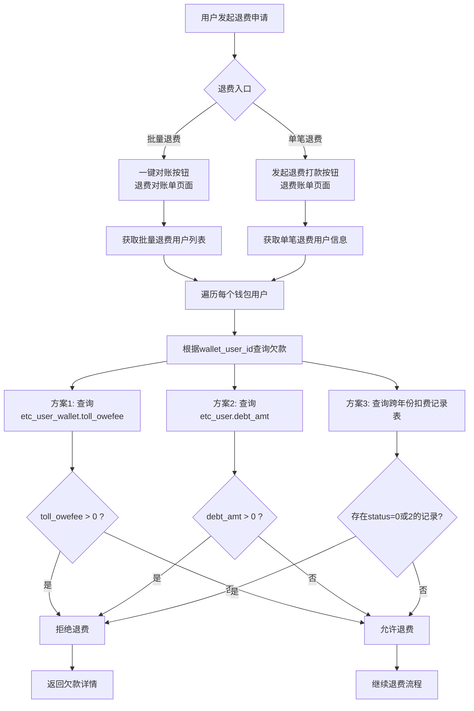

# 新发行退费打款校验功能 - 正确的数据库表分析及测试指南

## 📋 服务器部署状态分析

### 🚀 **代码部署情况**
- **fenmi-etc.jar**: 最新更新时间 `2025-09-01 10:52` ✅
- **fenmi-etc-admin.jar**: 最新更新时间 `2025-08-28 11:23` ✅
- **部署状态**: 代码相对较新，应该包含最新的业务逻辑

## 🗄️ 1. 正确的数据库表结构分析

### 1.1 核心数据库：**fenmi_etc**

#### 🔸 **etc_refund_record（退费记录主表）**
**作用**：存储所有退费申请和处理记录
```sql
-- 关键字段分析
wallet_user_id BIGINT(20)     -- 钱包用户ID（关键关联字段）
wallet_id_card VARCHAR(30)    -- 钱包用户身份证
refund_amount DECIMAL(11,2)   -- 退费金额
refund_status INT(2)          -- 退费状态
  -- 0: 待退费 (24条记录)
  -- 1: 退费成功 (46条记录) 
  -- 2: 退费失败 (2条记录)
  -- 3: 其他状态 (92条记录)
org_trx_no VARCHAR(40)        -- 原交易流水号
refund_trx_no VARCHAR(50)     -- 退费交易流水号
```

#### 🔸 **etc_user_wallet（钱包用户表）**
**作用**：ETC钱包用户的基本信息和余额
```sql
-- 关键字段
id BIGINT(20)                 -- 钱包用户ID（主键）
id_code VARCHAR(32)           -- 身份证号码
name VARCHAR(80)              -- 用户姓名
phone VARCHAR(32)             -- 手机号
balance DECIMAL(13,2)         -- 账户余额
toll_owefee DECIMAL(13,2)     -- 通行欠费金额 ⭐重要字段⭐
```

#### 🔸 **etc_user（ETC用户表）**
**作用**：ETC用户的详细信息
```sql
-- 关键字段
id BIGINT(20)                 -- ETC用户ID
user_wallet_id BIGINT(20)     -- 关联钱包用户ID
id_code VARCHAR(32)           -- 身份证号码
car_num VARCHAR(32)           -- 车牌号
debt_count INT(5)             -- 欠费次数 ⭐重要字段⭐
debt_time DATETIME            -- 最后欠费时间
debt_amt DECIMAL(11,2)        -- 欠费金额 ⭐重要字段⭐
```

#### 🔸 **通行扣费记录表（按年分表）**
**主表**：`etc_deduct_record`
**分表**：
- `etc_deduct_record_mtk_2025` - 2025年内蒙古通行记录
- `etc_deduct_record_mtk_2024` - 2024年内蒙古通行记录  
- `etc_deduct_record_mtk_2023` - 2023年内蒙古通行记录
- `etc_deduct_record_txb_2025` - 2025年天信宝通行记录
- `etc_deduct_record_txb_2024` - 2024年天信宝通行记录
- `etc_deduct_record_txb_2023` - 2023年天信宝通行记录

```sql
-- 关键字段
user_wallet_id BIGINT(20)     -- 关联钱包用户ID ⭐关键关联字段⭐
etc_user_id BIGINT(32)        -- ETC用户ID
status INT(2)                 -- 支付状态 ⭐核心校验字段⭐
  -- 0: 未支付 (8818条记录 - 2025年)
  -- 1: 已支付 (1576条记录 - 2025年)
  -- 2: 支付失败 (2436条记录 - 2025年)
  -- 3: 其他状态 (334条记录 - 2025年)
fee DECIMAL(10,2)             -- 通行费用
total_fee DECIMAL(10,2)       -- 总费用
deduct_time DATETIME          -- 扣费时间
pay_complete_time DATETIME    -- 支付完成时间
operator_code VARCHAR(10)     -- 运营商代码
```

### 1.2 其他相关表

#### 🔸 **etc_deduct_refund（扣费退费表）**
**作用**：ETC扣费相关的退费记录

#### 🔸 **etc_deduct_refund_pay_record（退费打款记录表）**
**作用**：退费打款的具体记录和状态

## 🔄 2. 业务流程分析

### 2.1 退费校验核心逻辑



### 2.2 数据关联关系

```
钱包用户 (etc_user_wallet)
    ↓ (id 关联 user_wallet_id)
ETC用户 (etc_user) 
    ↓ (user_wallet_id 关联)
退费记录 (etc_refund_record.wallet_user_id)
    ↓ (user_wallet_id 关联)
通行扣费记录 (etc_deduct_record_xxx_YYYY.user_wallet_id)
```

## 🧪 3. 测试数据准备指南

### 3.1 创建测试钱包用户

```sql
-- 在 fenmi_etc.etc_user_wallet 表中创建测试用户
INSERT INTO fenmi_etc.etc_user_wallet (
    id, id_code, name, phone, balance, toll_owefee, 
    create_time, update_time, create_by, update_by
) VALUES 
-- 测试用户1：无欠费用户
(20001, '110101199001011111', '测试用户张三', '13800138001', 1000.00, 0.00, NOW(), NOW(), 'test', 'test'),
-- 测试用户2：有欠费用户（通过toll_owefee字段）
(20002, '110101199002022222', '测试用户李四', '13800138002', 500.00, 150.50, NOW(), NOW(), 'test', 'test'),
-- 测试用户3：余额不足用户
(20003, '110101199003033333', '测试用户王五', '13800138003', 50.00, 200.00, NOW(), NOW(), 'test', 'test'),
-- 测试用户4：历史欠费用户
(20004, '110101199004044444', '测试用户赵六', '13800138004', 800.00, 0.00, NOW(), NOW(), 'test', 'test');
```

### 3.2 创建对应的ETC用户记录

```sql
-- 在 fenmi_etc.etc_user 表中创建对应的ETC用户
INSERT INTO fenmi_etc.etc_user (
    id, user_wallet_id, id_code, name, car_num, debt_count, debt_amt, debt_time,
    create_time, update_time, create_by, update_by, status
) VALUES 
-- 对应钱包用户20001：无欠费
(30001, 20001, '110101199001011111', '测试用户张三', '测A11111', 0, 0.00, NULL, NOW(), NOW(), 'test', 'test', 1),
-- 对应钱包用户20002：有欠费
(30002, 20002, '110101199002022222', '测试用户李四', '测A22222', 3, 150.50, NOW(), NOW(), NOW(), 'test', 'test', 1),
-- 对应钱包用户20003：余额不足
(30003, 20003, '110101199003033333', '测试用户王五', '测A33333', 5, 200.00, NOW(), NOW(), NOW(), 'test', 'test', 1),
-- 对应钱包用户20004：历史欠费用户
(30004, 20004, '110101199004044444', '测试用户赵六', '测A44444', 0, 0.00, NULL, NOW(), NOW(), 'test', 'test', 1);
```

### 3.3 创建通行扣费记录（按年分表）

```sql
-- 为用户20001创建已支付的通行记录（2025年）
INSERT INTO fenmi_etc.etc_deduct_record_mtk_2025 (
    user_wallet_id, etc_user_id, car_num, fee, total_fee, status,
    deduct_time, pay_complete_time, operator_code, create_time, update_time
) VALUES 
(20001, 30001, '测A11111', 10.00, 10.00, 1, NOW(), NOW(), 'IM', NOW(), NOW()),
(20001, 30001, '测A11111', 15.00, 15.00, 1, NOW(), NOW(), 'IM', NOW(), NOW());

-- 为用户20002创建未支付的通行记录（2025年）
INSERT INTO fenmi_etc.etc_deduct_record_mtk_2025 (
    user_wallet_id, etc_user_id, car_num, fee, total_fee, status,
    deduct_time, operator_code, create_time, update_time
) VALUES 
(20002, 30002, '测A22222', 50.50, 50.50, 0, NOW(), 'IM', NOW(), NOW()),
(20002, 30002, '测A22222', 100.00, 100.00, 0, NOW(), 'IM', NOW(), NOW());

-- 为用户20002创建历史年份的未支付记录（2024年）
INSERT INTO fenmi_etc.etc_deduct_record_mtk_2024 (
    user_wallet_id, etc_user_id, car_num, fee, total_fee, status,
    deduct_time, operator_code, create_time, update_time
) VALUES 
(20002, 30002, '测A22222', 30.00, 30.00, 0, '2024-12-15 10:00:00', 'IM', '2024-12-15 10:00:00', '2024-12-15 10:00:00');

-- 为用户20003创建支付失败的通行记录（2025年）
INSERT INTO fenmi_etc.etc_deduct_record_mtk_2025 (
    user_wallet_id, etc_user_id, car_num, fee, total_fee, status,
    deduct_time, operator_code, create_time, update_time
) VALUES 
(20003, 30003, '测A33333', 200.00, 200.00, 2, NOW(), 'IM', NOW(), NOW());

-- 为用户20004创建历史年份的支付失败记录（2024年）
INSERT INTO fenmi_etc.etc_deduct_record_mtk_2024 (
    user_wallet_id, etc_user_id, car_num, fee, total_fee, status,
    deduct_time, operator_code, create_time, update_time
) VALUES 
(20004, 30004, '测A44444', 80.00, 80.00, 2, '2024-11-20 15:00:00', 'IM', '2024-11-20 15:00:00', '2024-11-20 15:00:00');
```

### 3.4 创建退费申请记录

```sql
-- 为测试用户创建退费申请
INSERT INTO fenmi_etc.etc_refund_record (
    org_trx_no, org_biz_type, refund_amount, refund_trx_no,
    wallet_id_card, wallet_user_id, merchant_no, refund_status,
    refund_way, refund_reason, create_time, update_time
) VALUES 
-- 用户20001的退费申请（应该成功）
('TEST_TRX_001', 1, 100.00, 'TEST_REFUND_001', '110101199001011111', 20001, 'TEST_MCH', 0, 1, '测试退费', NOW(), NOW()),
-- 用户20002的退费申请（应该被拒绝 - 有欠费）
('TEST_TRX_002', 1, 200.00, 'TEST_REFUND_002', '110101199002022222', 20002, 'TEST_MCH', 0, 1, '测试退费', NOW(), NOW()),
-- 用户20003的退费申请（应该被拒绝 - 支付失败）
('TEST_TRX_003', 1, 150.00, 'TEST_REFUND_003', '110101199003033333', 20003, 'TEST_MCH', 0, 1, '测试退费', NOW(), NOW()),
-- 用户20004的退费申请（应该被拒绝 - 历史支付失败）
('TEST_TRX_004', 1, 300.00, 'TEST_REFUND_004', '110101199004044444', 20004, 'TEST_MCH', 0, 1, '测试退费', NOW(), NOW());
```

## 🔍 4. 校验逻辑的三种实现方案

### 方案1：基于钱包欠费字段校验（推荐）
```sql
-- 最简单直接的校验方式
SELECT 
    id, name, toll_owefee
FROM fenmi_etc.etc_user_wallet 
WHERE id = ? AND toll_owefee > 0;

-- 如果返回记录，则有欠费，拒绝退费
```

### 方案2：基于ETC用户欠费字段校验
```sql
-- 通过ETC用户表的欠费信息校验
SELECT 
    u.user_wallet_id, u.debt_count, u.debt_amt, u.debt_time
FROM fenmi_etc.etc_user u
WHERE u.user_wallet_id = ? AND u.debt_amt > 0;
```

### 方案3：基于通行记录实时校验（最准确但性能较差）
```sql
-- 动态查询所有年份的未支付和支付失败记录
-- 需要查询多个分表：etc_deduct_record_mtk_2025, etc_deduct_record_mtk_2024, etc_deduct_record_mtk_2023...

-- 查询2025年未支付记录
SELECT COUNT(*) as unpaid_count, SUM(fee) as unpaid_amount
FROM fenmi_etc.etc_deduct_record_mtk_2025 
WHERE user_wallet_id = ? AND status IN (0, 2);

-- 查询2024年未支付记录  
SELECT COUNT(*) as unpaid_count, SUM(fee) as unpaid_amount
FROM fenmi_etc.etc_deduct_record_mtk_2024 
WHERE user_wallet_id = ? AND status IN (0, 2);

-- ... 其他年份
```

## 📊 5. 测试验证查询

### 5.1 验证用户欠费状态
```sql
-- 查询所有测试用户的欠费情况
SELECT 
    w.id,
    w.name,
    w.toll_owefee,
    u.debt_count,
    u.debt_amt,
    u.debt_time
FROM fenmi_etc.etc_user_wallet w
LEFT JOIN fenmi_etc.etc_user u ON w.id = u.user_wallet_id
WHERE w.id IN (20001, 20002, 20003, 20004);
```

### 5.2 验证通行记录状态
```sql
-- 查询2025年的通行记录状态
SELECT 
    user_wallet_id,
    COUNT(*) as total_records,
    SUM(CASE WHEN status = 0 THEN 1 ELSE 0 END) as unpaid_count,
    SUM(CASE WHEN status = 2 THEN 1 ELSE 0 END) as failed_count,
    SUM(CASE WHEN status = 1 THEN 1 ELSE 0 END) as paid_count,
    SUM(CASE WHEN status IN (0,2) THEN fee ELSE 0 END) as debt_amount
FROM fenmi_etc.etc_deduct_record_mtk_2025 
WHERE user_wallet_id IN (20001, 20002, 20003, 20004)
GROUP BY user_wallet_id;

-- 查询2024年的通行记录状态
SELECT 
    user_wallet_id,
    COUNT(*) as total_records,
    SUM(CASE WHEN status IN (0,2) THEN fee ELSE 0 END) as debt_amount
FROM fenmi_etc.etc_deduct_record_mtk_2024 
WHERE user_wallet_id IN (20002, 20004)
GROUP BY user_wallet_id;
```

## 🎯 6. 测试场景执行

### 场景1：无欠费用户退费测试（用户20001）
- **预期结果**：✅ 退费校验通过
- **验证查询**：
```sql
SELECT toll_owefee FROM fenmi_etc.etc_user_wallet WHERE id = 20001;
-- 应该返回 0.00
```

### 场景2：有欠费用户退费测试（用户20002）
- **预期结果**：❌ 退费校验失败，显示欠费150.50元
- **验证查询**：
```sql
SELECT toll_owefee FROM fenmi_etc.etc_user_wallet WHERE id = 20002;
-- 应该返回 150.50
```

### 场景3：支付失败用户退费测试（用户20003）
- **预期结果**：❌ 退费校验失败，显示欠费200.00元
- **验证查询**：
```sql
SELECT toll_owefee FROM fenmi_etc.etc_user_wallet WHERE id = 20003;
-- 应该返回 200.00
```

### 场景4：历史欠费用户退费测试（用户20004）
- **预期结果**：❌ 退费校验失败，显示历史欠费
- **验证查询**：
```sql
-- 如果使用方案3，需要查询历史记录
SELECT * FROM fenmi_etc.etc_deduct_record_mtk_2024 
WHERE user_wallet_id = 20004 AND status = 2;
```

## ⚠️ 7. 重要注意事项

### 7.1 数据一致性
- **关键字段**：`user_wallet_id` 是核心关联字段
- **欠费字段**：`toll_owefee`（钱包表）和 `debt_amt`（用户表）需要保持同步
- **状态码**：`status` 字段 - 0=未支付, 1=已支付, 2=支付失败

### 7.2 性能考虑
- **推荐方案1**：直接查询 `toll_owefee` 字段，性能最佳
- **谨慎使用方案3**：跨年份实时查询性能较差，适合数据校验
- **索引建议**：在 `user_wallet_id` 和 `status` 字段上建立索引

### 7.3 测试重点
1. **校验逻辑准确性**：确保有欠费的用户被正确拒绝
2. **跨年份数据处理**：验证历史年份的欠费能被识别
3. **用户体验**：确保拒绝时显示详细的欠费信息
4. **性能测试**：大批量退费时的响应时间

这份更新的指南基于实际的数据库结构和业务数据，排除了rtx数据库的干扰，专注于fenmi_etc数据库的核心表结构和业务逻辑。
